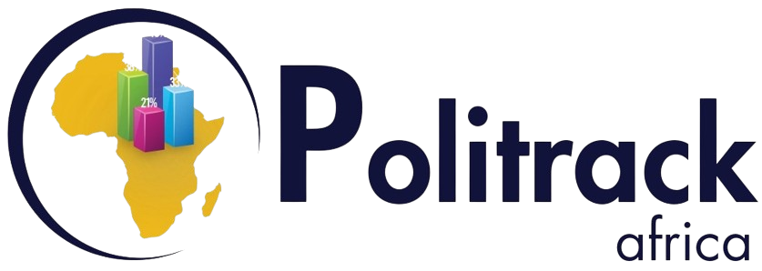

# Politrack Africa



**Data-Driven Insights for Political & Socio-Economic Strategy**

Politrack Africa empowers leaders with cutting-edge opinion polling, research, and strategic advisory services tailored to Africa's complex political and socio-economic landscape. This is the official website showcasing our research reports, insights, and services across 45+ African countries.

## 🌍 About Politrack Africa

Politrack Africa is a leading research and strategic advisory platform focused on African political and socio-economic trends. We provide:

- **Opinion Polling & Research**: Comprehensive polling services across African nations
- **Strategic Advisory**: Data-driven recommendations for political and business leaders
- **Insights & Reports**: Regular publications on African political and economic trends
- **Case Studies**: Real-world analysis of political campaigns and policy implementations

## ✨ Features

- 📊 **Interactive Data Visualizations**: Real-time charts and graphs using Recharts with custom tooltips
- 📱 **Responsive Design**: Optimized for desktop, tablet, and mobile devices with enhanced mobile navigation
- 🌙 **Dark/Light Theme**: Toggle between themes with next-themes
- 📈 **Live Reports**: Dynamic reporting dashboard with up-to-date insights
- 🔍 **Insights Section**: Searchable database of research reports and findings with PDF downloads
- 🌍 **Multi-Country Coverage**: Content covering 45+ African countries with regional breakdown
- 🎯 **Enhanced User Experience**: Smooth scrolling navigation, toast notifications, and interactive elements
- 💼 **Professional Contact System**: Multiple office locations with contact details
- 🏆 **Trust Indicators**: Partner logos and certifications display
- 📱 **Mobile-First Design**: Collapsible mobile menu and responsive components

## 🚀 Tech Stack

- **Framework**: [Next.js 15.5.0](https://nextjs.org/) with App Router
- **Runtime**: [React 19.1.0](https://react.dev/) with React DOM 19.1.0
- **UI Library**: [Radix UI](https://www.radix-ui.com/) comprehensive component library
- **Styling**: [TailwindCSS v4](https://tailwindcss.com/) with custom design system and animations
- **Charts**: [Recharts](https://recharts.org/) for interactive data visualization
- **Icons**: [Lucide React](https://lucide.dev/) & [React Icons](https://react-icons.github.io/react-icons/)
- **Forms**: [React Hook Form](https://react-hook-form.com/) with [Zod](https://zod.dev/) validation
- **Notifications**: [React Toastify](https://fkhadra.github.io/react-toastify/) & [Sonner](https://sonner.emilkowal.ski/)
- **Typography**: [Geist Font](https://vercel.com/font)
- **Analytics**: [Vercel Analytics](https://vercel.com/analytics)
- **Data Fetching**: [SWR](https://swr.vercel.app/) for efficient data fetching
- **Carousels**: [Embla Carousel](https://www.embla-carousel.com/) for interactive carousels
- **Utilities**: [clsx](https://github.com/lukeed/clsx), [tailwind-merge](https://github.com/dcastil/tailwind-merge), [class-variance-authority](https://cva.style/docs)

## 📋 Prerequisites

Before you begin, ensure you have the following installed:

- **Node.js** (version 18.0 or higher)
- **npm**, **yarn**, **pnpm**, or **bun** package manager
- **Git** for version control

## 🛠️ Installation & Setup

1. **Clone the repository**

   ```bash
   git clone https://github.com/joselivia/politrack.git
   cd politrack
   ```

2. **Install dependencies**

   ```bash
   npm install
   # or
   yarn install
   # or
   pnpm install
   # or
   bun install
   ```

3. **Start the development server**

   ```bash
   npm run dev
   # or
   yarn dev
   # or
   pnpm dev
   # or
   bun dev
   ```

4. **Open your browser**

   Navigate to [http://localhost:3000](http://localhost:3000) to see the application running.

## 📜 Available Scripts

```bash
npm run dev      # Start development server
npm run build    # Build for production
npm run start    # Start production server
npm run lint     # Run ESLint for code quality
```

## 📁 Project Structure

```
politrack/
├── app/                     # Next.js App Router pages
│   ├── layout.tsx          # Root layout component
│   ├── page.tsx            # Homepage
│   ├── not-found.tsx       # 404 page
│   └── insights/           # Insights section pages
├── components/             # Reusable React components
│   ├── ui/                 # Shadcn/ui components
│   ├── reports/            # Report-specific components
│   ├── hero-section.tsx    # Homepage hero section
│   ├── header.tsx          # Site navigation with mobile menu
│   ├── footer.tsx          # Site footer with contact info
│   ├── about-section.tsx   # About section with stats
│   ├── services-section.tsx # Services showcase
│   ├── insights-section.tsx # Insights and reports
│   └── case-studies-section.tsx # Success stories
├── content/                # Static content and data
│   └── insights-content.ts # Insights data
├── config/                 # Configuration files
│   └── baseUrl.ts          # API base URL configuration
├── hooks/                  # Custom React hooks
├── lib/                    # Utility functions
├── public/                 # Static assets
│   ├── flags/              # Country flag images
│   └── trusts/             # Partner organization logos
└── styles/                 # Global styles
```

## 🔧 Core Services

### 🗳️ Political Polling

- **Election Forecasting**: Advanced statistical models for accurate predictions
- **Voter Behavior Analysis**: Deep insights into demographic trends
- **Coalition Modeling**: Strategic alliance mapping and optimization
- **Real-time Monitoring**: Live election tracking and sentiment analysis

### 📈 Socio-Economic Research

- **Development Indicators**: SDG progress tracking and impact measurement
- **Governance Analysis**: Public sector performance and accountability studies
- **Climate Perception**: Environmental awareness and policy support research
- **Social Inclusion**: Gender equity and minority rights research

### 🎯 Strategic Advisory

- **Political Risk Assessment**: Comprehensive threat analysis and mitigation
- **Campaign Optimization**: Data-driven strategy development
- **Message Testing**: Evidence-based communication strategies
- **Stakeholder Mapping**: Key player identification and engagement

### 🌐 Consumer Insights

- **Market Segmentation**: Detailed demographic and psychographic analysis
- **Behavioral Trends**: Consumer preference and adoption patterns
- **Brand Perception**: Reputation and positioning studies
- **Cultural Context**: Localized market understanding

## 📊 Platform Features

### Interactive Dashboard

- Real-time polling data visualization with custom tooltips
- Regional breakdown charts with hover effects
- Economic indicators tracking (GDP growth vs inflation)
- Comparative country analysis with interactive elements

### Research Reports

- Downloadable PDF reports with subscription features
- Multi-language support across 30+ African languages
- Sectioned content with key findings and actionable insights
- Historical data tracking with trend analysis

### Case Studies

- **Political Success Stories**: Electoral turnaround strategies (Nigeria 2023)
- **Policy Impact**: Gender reform initiatives (Rwanda)
- **Risk Mitigation**: Crisis management and strategic communication
- **Market Entry**: Consumer behavior and business strategy optimization

## 🎨 UI Components

This project uses a comprehensive design system built on top of Radix UI and TailwindCSS, including:

- **Layout**: Cards, Containers, Grid Systems
- **Navigation**: Headers, Breadcrumbs, Sidebars, Mobile Menus
- **Forms**: Inputs, Selects, Checkboxes, Validation
- **Feedback**: Alerts, Toasts, Progress Indicators, Notifications
- **Data Display**: Tables, Charts, Badges, Avatars
- **Overlay**: Modals, Popovers, Tooltips, Dialogs

## 🌍 Supported Countries

The platform covers political and socio-economic insights for **45+ African countries**, with regional distribution:

### Regional Coverage

- **East Africa (35%)**: Kenya 🇰🇪, Tanzania, Uganda, Rwanda, Ethiopia, and more
- **West Africa (30%)**: Ghana 🇬🇭, Nigeria, Senegal 🇸🇳, Mali, Burkina Faso, and more
- **Southern Africa (20%)**: South Africa 🇿🇦, Zimbabwe, Botswana, Zambia, and more
- **Central Africa (15%)**: Democratic Republic of Congo, Cameroon, Chad, and more

### Language Support

- **30+ African Languages** supported
- Culturally-aware research methodologies
- Local partnerships in every region
- 90% Africa-based research team

## 🏆 Quality Assurance

- **ISO 20252 Certified**: International standard for market research
- **ESOMAR Member**: European Society for Opinion and Marketing Research
- **Independent Research**: Non-partisan integrity and objectivity
- **95% Confidence Level**: Statistical accuracy in all polling
- **Real-time Analytics**: Live data processing and reporting

## 🤝 Contributing

We welcome contributions to improve Politrack Africa! Please follow these steps:

1. Fork the repository
2. Create a feature branch (`git checkout -b feature/amazing-feature`)
3. Commit your changes (`git commit -m 'Add amazing feature'`)
4. Push to the branch (`git push origin feature/amazing-feature`)
5. Open a Pull Request

## 📄 License

This project is private and proprietary to Politrack Africa. All rights reserved.

## 📞 Contact & Support

### 🏢 Office Locations

- **Headquarters**: Nairobi, Kenya - Westlands Business District
- **Regional Offices**:
  - Accra, Ghana - Airport City
  - Johannesburg, South Africa - Sandton Central
  - Dakar, Senegal - Almadies District

### 📧 Get In Touch

- **Email**: insights@politrackafrica.co.ke
- **Phone**: +254 700 123 456
- **Website**: [politrack.africa](https://politrack.africa)
- **Repository**: [github.com/joselivia/politrack](https://github.com/joselivia/politrack)
- **Issues**: Report bugs and feature requests via GitHub Issues

### 🤝 Trusted Partners

- African Union
- UNDP Africa
- Nairobi County Government
- Fortune 500 Companies

## 🚀 Deployment

The easiest way to deploy this Next.js application is using [Vercel](https://vercel.com/):

1. Push your code to GitHub
2. Import your repository on Vercel
3. Vercel will automatically detect Next.js and configure the build settings
4. Your site will be deployed with automatic HTTPS and global CDN

For other deployment options, check the [Next.js deployment documentation](https://nextjs.org/docs/app/building-your-application/deploying).

---

Built with ❤️ for Africa by the Politrack team

- **Icons**: [Lucide React](https://lucide.dev/) & [React Icons](https://react-icons.github.io/react-icons/)
- **Forms**: [React Hook Form](https://react-hook-form.com/) with [Zod](https://zod.dev/) validation
- **Notifications**: [React Toastify](https://fkhadra.github.io/react-toastify/) & [Sonner](https://sonner.emilkowal.ski/)
- **Typography**: [Geist Font](https://vercel.com/font)
- **Analytics**: [Vercel Analytics](https://vercel.com/analytics)
- **Data Fetching**: [SWR](https://swr.vercel.app/) for efficient data fetching
- **Carousels**: [Embla Carousel](https://www.embla-carousel.com/) for interactive carousels
- **Utilities**: [clsx](https://github.com/lukeed/clsx), [tailwind-merge](https://github.com/dcastil/tailwind-merge), [class-variance-authority](https://cva.style/docs)

## 📋 Prerequisites

Before you begin, ensure you have the following installed:

- **Node.js** (version 18.0 or higher)
- **npm**, **yarn**, **pnpm**, or **bun** package manager
- **Git** for version control

## 🛠️ Installation & Setup

1. **Clone the repository**

   ```bash
   git clone https://github.com/joselivia/politrack.git
   cd politrack
   ```

2. **Install dependencies**

   ```bash
   npm install
   # or
   yarn install
   # or
   pnpm install
   # or
   bun install
   ```

3. **Start the development server**

   ```bash
   npm run dev
   # or
   yarn dev
   # or
   pnpm dev
   # or
   bun dev
   ```

4. **Open your browser**

   Navigate to [http://localhost:3000](http://localhost:3000) to see the application running.

## 📜 Available Scripts

```bash
npm run dev      # Start development server
npm run build    # Build for production
npm run start    # Start production server
npm run lint     # Run ESLint for code quality
```

## 📁 Project Structure

```
politrack/
├── app/                     # Next.js App Router pages
│   ├── layout.tsx          # Root layout component
│   ├── page.tsx            # Homepage
│   ├── not-found.tsx       # 404 page
│   └── insights/           # Insights section pages
├── components/             # Reusable React components
│   ├── ui/                 # Shadcn/ui components
│   ├── reports/            # Report-specific components
│   ├── hero-section.tsx    # Homepage hero section
│   ├── header.tsx          # Site navigation
│   └── footer.tsx          # Site footer
├── content/                # Static content and data
│   └── insights-content.ts # Insights data
├── config/                 # Configuration files
│   └── baseUrl.ts          # API base URL configuration
├── hooks/                  # Custom React hooks
├── lib/                    # Utility functions
├── public/                 # Static assets
│   ├── flags/              # Country flag images
│   └── trusts/             # Partner organization logos
└── styles/                 # Global styles
```

## 🎨 UI Components

This project uses a comprehensive design system built on top of Radix UI and TailwindCSS, including:

- **Layout**: Cards, Containers, Grid Systems
- **Navigation**: Headers, Breadcrumbs, Sidebars
- **Forms**: Inputs, Selects, Checkboxes, Validation
- **Feedback**: Alerts, Toasts, Progress Indicators
- **Data Display**: Tables, Charts, Badges, Avatars
- **Overlay**: Modals, Popovers, Tooltips

## 🌍 Supported Countries

The platform covers political and socio-economic insights for **45+ African countries**, with regional distribution:

### Regional Coverage

- **East Africa (35%)**: Kenya 🇰🇪, Tanzania, Uganda, Rwanda, Ethiopia, and more
- **West Africa (30%)**: Ghana ��, Nigeria, Senegal 🇸🇳, Mali, Burkina Faso, and more
- **Southern Africa (20%)**: South Africa 🇿🇦, Zimbabwe, Botswana, Zambia, and more
- **Central Africa (15%)**: Democratic Republic of Congo, Cameroon, Chad, and more

### Language Support

- **30+ African Languages** supported
- Culturally-aware research methodologies
- Local partnerships in every region
- 90% Africa-based research team## 📊 Features Overview

### Interactive Dashboard

- Real-time polling data visualization
- Regional breakdown charts
- Trend analysis over time
- Comparative country analysis

### Research Reports

- Downloadable PDF reports
- Multi-language support
- Sectioned content with key findings
- Historical data tracking

### Case Studies

- Political campaign analysis
- Policy implementation tracking
- Socio-economic impact studies
- Success stories and lessons learned

## 🤝 Contributing

We welcome contributions to improve Politrack Africa! Please follow these steps:

1. Fork the repository
2. Create a feature branch (`git checkout -b feature/amazing-feature`)
3. Commit your changes (`git commit -m 'Add amazing feature'`)
4. Push to the branch (`git push origin feature/amazing-feature`)
5. Open a Pull Request

## 📄 License

This project is private and proprietary to Politrack Africa. All rights reserved.

## 📞 Contact & Support

- **Website**: [politrackafrica.co.ke](https://politrackafrica.co.ke)
- **Repository**: [github.com/joselivia/politrack](https://github.com/joselivia/politrack)
- **Issues**: Report bugs and feature requests via GitHub Issues

## 🚀 Deployment

The easiest way to deploy this Next.js application is using [Vercel](https://vercel.com/):

1. Push your code to GitHub
2. Import your repository on Vercel
3. Vercel will automatically detect Next.js and configure the build settings
4. Your site will be deployed with automatic HTTPS and global CDN

For other deployment options, check the [Next.js deployment documentation](https://nextjs.org/docs/app/building-your-application/deploying).

---

Built with ❤️ for Africa by the Politrack team
